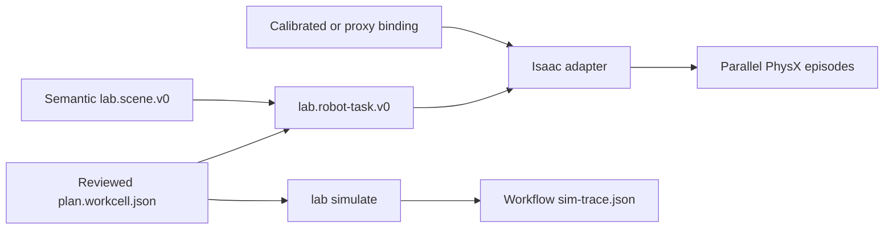

# Lab to Isaac Lab plate-transfer prototype

This project turns a real Lab workcell handoff into a checked Isaac Lab
manager-based RL environment configuration. It keeps two contracts separate:



`sim-trace.json` remains the schedule and operator-attention record. RL
observations, actions, rewards, and episode telemetry belong to the Isaac side.

## Generate the Golden Gate task

From the repository root:

```sh
lab build examples/golden-gate
lab scene examples/golden-gate
lab robot task \
  examples/golden-gate/.lab/build/workcell-star/wave-001 \
  --node assembly_thermocycle.to-odtc-1
```

The last command writes:

```text
examples/golden-gate/.lab/build/workcell-star/wave-001/robot-tasks/
  assembly_thermocycle-to-odtc-1.json
```

It fails if the node is not a handoff or if `reaction_plate`, `star-1`, or
`odtc-1` does not resolve uniquely with the right semantic kind in
`scene.json`. Plan and scene references are relative to the task file, so the
wave remains portable as a directory.

## Validate the adapter contract anywhere

The parser and cross-checks have no Isaac dependency, so they run on macOS and
in ordinary CI:

```sh
uv run --project integrations/isaac-lab --locked lab-isaac inspect \
  --task examples/golden-gate/.lab/build/workcell-star/wave-001/robot-tasks/assembly_thermocycle-to-odtc-1.json \
  --binding integrations/isaac-lab/examples/golden-gate-plate-transfer.binding.toml \
  --json
```

The included binding is explicitly `prototype-proxy`. The stock Franka demo
does not establish a qualified grasp for a full SBS plate, so this first body
is a scaled, gripper-compatible plate proxy. It maps the real station
identities onto two reachable poses on the stock Franka table. Its values were
not measured from a physical plate, Hamilton STAR, ODTC, or gripper.

## Run the PhysX smoke gate

Install this project into the Python environment supplied by a current Isaac
Lab installation on supported Linux/CUDA hardware, then run:

```sh
lab-isaac smoke \
  --task /path/to/assembly_thermocycle-to-odtc-1.json \
  --binding /path/to/golden-gate-plate-transfer.binding.toml \
  --num-envs 32 \
  --steps 8
```

The gate launches the stock Franka relative-IK lift environment, replaces the
cube with the bound plate cuboid and dynamics, installs the source reset range
and destination command, resets every parallel environment, and submits
policy-shaped actions. Success requires the object to reach the commanded pose
within position and orientation tolerances, settle below configured linear and
angular velocity limits, and be released by the gripper. The same predicate
provides a sparse success reward and terminates the episode.

The adapter was source-checked against Isaac Lab's current upstream
[manager-based lift configuration](https://github.com/isaac-sim/IsaacLab/blob/main/source/isaaclab_tasks/isaaclab_tasks/manager_based/manipulation/lift/lift_env_cfg.py)
and [Franka relative-IK specialization](https://github.com/isaac-sim/IsaacLab/blob/main/source/isaaclab_tasks/isaaclab_tasks/manager_based/manipulation/lift/config/franka/ik_rel_env_cfg.py).
That is not a substitute for running the smoke gate in the actual Isaac
runtime.

This smoke command is an environment-construction gate, not training. The next
slice is to expose the configuration through an Isaac task registry and train
a baseline policy before adding scan-derived geometry, grasp randomization,
vision observations, or a humanoid embodiment. A real plate-transfer milestone
also requires a plate-compatible end effector (or carrier) and measured plate
collision geometry; scaling the proxy to SBS dimensions alone would make the
stock Franka grasp invalid.

## C3 compute gate

C3 is the primary supported remote compute provider. The tracked [`.c3`](.c3)
project requests one L40-class GPU and uses the locked Python runtime under
[`c3/runtime`](c3/runtime) to run this same smoke gate. It is a capability
probe, not a trainer, and its twenty-minute maximum does not authorize a paid
submission.

Before reviewing a capability submission, validate the ignored local
credential and live catalog without creating a job:

```sh
lab compute doctor
```

The probe writes `lab.compute-capability.v0` to C3's artifact directory even
when Isaac startup fails. It records host, driver, CUDA, package, and smoke
facts but never copies credentials or the complete process environment.

## Development checks

```sh
cd integrations/isaac-lab
uv run --locked ruff format --check src tests c3/probe.py
uv run --locked ruff check src tests c3/probe.py
uv run --locked mypy
uv run --locked pytest
```
